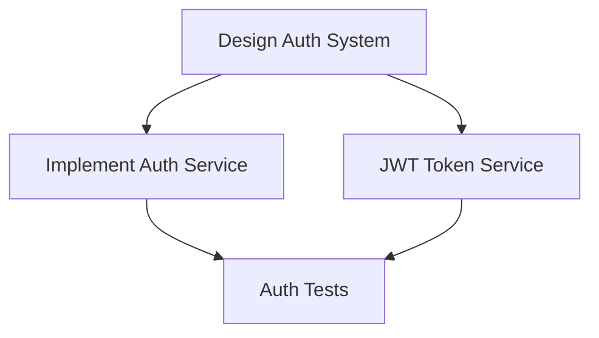

# QPLAN Command - Technical Validation & Refinement

Analyze similar parts of the codebase and determine whether your plan:

- is consistent with rest of codebase
- introduces minimal changes
- reuses existing code

## Enhanced Purpose

Validate and refine sprint plans created by QNEW, ensuring technical feasibility
and creating detailed implementation guidance for QDIRECTOR.

## Workflow

### 1. Sprint Plan Analysis

When given a sprint plan (from /qnew):

- Load and parse task definitions
- Validate dependencies are logical
- Check complexity estimates against codebase
- Identify potential technical blockers

### 2. Codebase Consistency Check

**Pattern Analysis**:

```yaml
For each task:
  1. Search for similar implementations:
    - Use Grep to find related patterns
    - Analyze existing service structures
    - Check current testing approaches

  2. Validate approach:
    - Does it match existing patterns?
    - Are we reinventing something?
    - Can we extend existing code?

  3. Update task with findings:
    - Reference files to follow
    - Patterns to maintain
    - Code to reuse
```

### 3. Dependency Validation

**Dependency Graph Analysis**:

- Verify no circular dependencies
- Check resource conflicts (same files modified)
- Identify missing dependencies
- Optimize parallel execution opportunities

**Output Mermaid Diagram**:



### 4. Technical Feasibility Assessment

For each task, assess:

**Architecture Tasks**:

- Do proposed designs align with current architecture?
- Are there existing patterns to follow?
- What security considerations exist?
- Reference: `/docs/architecture/`, existing services

**Implementation Tasks**:

- What existing code can be leveraged?
- Are proposed APIs consistent with current ones?
- Database schema compatibility?
- Estimated actual complexity based on codebase

**Testing Tasks**:

- Current test coverage baseline?
- Testing framework and patterns in use?
- Performance benchmarks to meet?
- Integration test requirements?

### 5. Risk Identification

**Technical Risks**:

- Breaking changes to existing APIs
- Database migration complexity
- Performance impacts
- Security vulnerabilities
- Third-party dependency issues

**Mitigation Strategies**:

- Feature flags for gradual rollout
- Backwards compatibility layers
- Performance testing gates
- Security review checkpoints

### 6. Enhanced Task Definitions

Update each task with:

```markdown
### Task: [TASK_ID]

- **Title**: [Original title]
- **Technical Approach**:
  - Pattern: Follow /src/services/[similar]Service.ts
  - Reuse: Extend BaseService class
  - Style: Match existing error handling
- **Implementation Notes**:
  - Use existing JWT library at /lib/auth/
  - Follow repository pattern from /src/repositories/
  - Error codes defined in /src/constants/errors.ts
- **Validation Steps**:
  - [ ] Matches existing service structure
  - [ ] Uses standard error handling
  - [ ] Follows naming conventions
  - [ ] Includes proper logging
- **Reference Implementation**: /src/services/UserService.ts
```

### 7. Exit Criteria Refinement

Make exit criteria more specific based on codebase:

**Before**: "Unit test coverage ≥ 80%" **After**: "Unit test coverage ≥ 80%
using Jest, following patterns in /src/**tests**/"

**Before**: "API endpoints return correct data" **After**: "API endpoints match
OpenAPI spec at /docs/api/v1/spec.yaml, use standard response format from
/src/utils/response.ts"

### 8. Context File Generation

For each task, generate a context bundle:

```yaml
TASK_CONTEXT:
  essential_files:
    - /src/services/BaseService.ts # Inherit from this
    - /src/types/auth.ts # Type definitions
    - /tests/helpers/auth.ts # Test utilities

  reference_files:
    - /src/services/UserService.ts # Similar pattern
    - /docs/api/standards.md # API conventions

  avoid_modifying:
    - /src/core/* # Core libraries
    - /src/legacy/* # Deprecated code
```

### 9. Output Enhancements

Create additional files:

1. **Technical Checklist** (`sprint-[date]-checklist.md`):

   - Pre-implementation setup steps
   - Environment configuration needed
   - Dependencies to install
   - Migration scripts to run

2. **Dependency Graph** (`sprint-[date]-deps.mermaid`):

   - Visual representation of task flow
   - Critical path highlighted
   - Parallel execution opportunities

3. **Risk Register** (`sprint-[date]-risks.md`):
   - Identified technical risks
   - Mitigation strategies
   - Fallback plans
   - Decision points for human review

### 10. QDIRECTOR Integration

Final output includes:

- Updated sprint plan with technical details
- Validated dependency graph
- Risk mitigation strategies
- Context file mappings
- Specific implementation guidance

This ensures QDIRECTOR has everything needed for successful execution.

## Example Enhancement

```
Original Task:
- Title: Implement user authentication
- Exit Criteria: Authentication works

Enhanced Task:
- Title: Implement user authentication
- Technical Approach:
  - Extend BaseAuthService from /src/services/base/
  - Use PassportJS config at /config/passport.ts
  - Follow UserService pattern for DB operations
- Implementation Notes:
  - JWT secret in env.JWT_SECRET
  - Session store uses Redis (see /config/redis.ts)
  - Rate limiting via express-rate-limit
- Exit Criteria:
  - [ ] POST /api/v1/auth/login validates credentials
  - [ ] Returns JWT token with 1hr expiry
  - [ ] Rate limited to 5 attempts/minute
  - [ ] Logs auth events to /logs/auth.log
  - [ ] 95% test coverage with edge cases
- Reference: /src/services/UserService.ts lines 45-120
```
