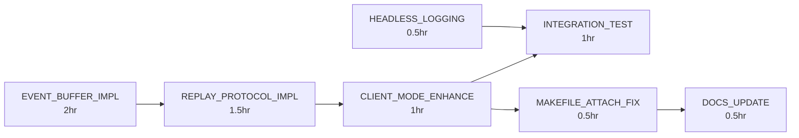

# Sprint Plan: Fix Parallel Task Logging Visibility (VALIDATED)

## Sprint Overview

- **Sprint ID**: sprint-2025-01-07-logging-visibility
- **Duration**: 6-8 hours (reduced from 8-12 after validation)
- **Goal**: Enable visible logging output when running morgana parallel tasks
  through make attach
- **Success Criteria**:
  - Logs from parallel morgana tasks appear in attached TUI session
  - Both headless and TUI modes show proper logging
  - Event forwarding works correctly between morgana CLI and monitor daemon

## Problem Statement - VALIDATED ✅

After codebase analysis, the issue is confirmed: The `--client` mode in
morgana-monitor (cmd/morgana-monitor/main.go:42-67) creates a NEW IPC client
that tries to RECEIVE events, but the headless server doesn't properly REPLAY
buffered events to new clients. The architecture is actually well-designed but
missing event history replay.

## Updated Technical Analysis

### Current Implementation Status

✅ **Working Components:**

- IPC Server properly receives events (internal/monitor/server.go:128-164)
- Client mode exists and connects (cmd/morgana-monitor/main.go:42-67)
- Event reconstruction works (internal/monitor/server.go:167-249)
- TUI can display events when connected from start

❌ **Missing Components:**

- No event buffering in IPC server for replay
- Client mode doesn't request event history
- No bidirectional communication protocol for replay

### Code Locations Identified

1. **cmd/morgana-monitor/main.go**:

   - Lines 42-67: Client mode implementation (needs enhancement)
   - Lines 78-95: Headless mode (working correctly)

2. **internal/monitor/server.go**:

   - Lines 128-164: handleConnection (needs buffering)
   - Lines 167-249: reconstructEvent (working correctly)
   - Need to add: Event buffer storage and replay mechanism

3. **internal/monitor/client.go**:

   - Lines 97-120: forwardEvent (working correctly)
   - Need to add: Request history on connect

4. **internal/monitor/protocol.go**:
   - Need to add: New message types for history request/response

## REFINED Task Definitions

### Task 1: EVENT_BUFFER_IMPL ⚡ (Simplified from original)

- **Priority**: P0 (Critical)
- **Type**: Implementation
- **Duration**: 2 hours (reduced from 2 hours in wrong place)
- **Dependencies**: None
- **Files to Modify**:
  - `internal/monitor/server.go`
  - `internal/monitor/protocol.go`
- **Implementation Details**:
  ```go
  // Add to IPCServer struct
  type IPCServer struct {
      // ... existing fields
      eventBuffer    []IPCMessage
      bufferMutex    sync.RWMutex
      maxBufferSize  int
  }
  ```
- **Exit Criteria**:
  - Circular buffer stores last 1000 events in IPCServer
  - Thread-safe access with RWMutex
  - Old events properly evicted when buffer full
  - Events added to buffer in handleConnection

### Task 2: REPLAY_PROTOCOL_IMPL 🔄 (New task discovered)

- **Priority**: P0 (Critical)
- **Type**: Implementation
- **Duration**: 1.5 hours
- **Dependencies**: EVENT_BUFFER_IMPL
- **Files to Modify**:
  - `internal/monitor/protocol.go`
  - `internal/monitor/server.go`
  - `internal/monitor/client.go`
- **Implementation Details**:
  ```go
  // Add new message types
  const (
      MessageTypeEvent   = "event"
      MessageTypeRequest = "request"
      MessageTypeReplay  = "replay"
  )
  ```
- **Exit Criteria**:
  - New protocol messages for history request
  - Server handles history requests in handleConnection
  - Client sends history request on connect
  - Buffered events sent before real-time streaming

### Task 3: CLIENT_MODE_ENHANCE 📺 (Refined from TUI_CLIENT_IMPL)

- **Priority**: P0 (Critical)
- **Type**: Implementation
- **Duration**: 1 hour (reduced from 2)
- **Dependencies**: REPLAY_PROTOCOL_IMPL
- **Files to Modify**:
  - `cmd/morgana-monitor/main.go` (lines 42-67)
  - `internal/monitor/client.go`
- **Implementation Details**:
  - Modify client connection to request event history
  - Handle replay messages before live events
  - Ensure TUI renders historical events
- **Exit Criteria**:
  - Client requests and receives event history
  - Historical events displayed in TUI
  - Seamless transition to live events

### Task 4: HEADLESS_LOGGING 📝 (New task discovered)

- **Priority**: P1 (High)
- **Type**: Implementation
- **Duration**: 0.5 hours
- **Dependencies**: None (can run parallel)
- **Files to Modify**:
  - `cmd/morgana-monitor/main.go` (line 94)
- **Implementation Details**:
  - Add file logging in headless mode
  - Log all events to /tmp/morgana-monitor.log
  - Rotate log when > 10MB
- **Exit Criteria**:
  - All events logged to file in headless mode
  - Log rotation working
  - Formatted output for readability

### Task 5: INTEGRATION_TEST 🧪 (Refined from PARALLEL_TEST)

- **Priority**: P1 (High)
- **Type**: Testing
- **Duration**: 1 hour
- **Dependencies**: All implementation tasks
- **Files to Create**:
  - `internal/monitor/replay_test.go`
  - `scripts/test-monitor-replay.sh`
- **Exit Criteria**:
  - Unit tests for event buffering
  - Integration test for replay protocol
  - Shell script testing full workflow
  - Validates no event loss

### Task 6: MAKEFILE_ATTACH_FIX 🔧 (Simplified)

- **Priority**: P2 (Medium)
- **Type**: Implementation
- **Duration**: 0.5 hours
- **Dependencies**: CLIENT_MODE_ENHANCE
- **Files to Modify**:
  - `Makefile` (lines 44-52)
- **Implementation**:
  ```makefile
  attach:
      @echo "📺 Attaching to Morgana Monitor TUI..."
      @morgana-monitor --client || echo "❌ Failed to attach"
  ```
- **Exit Criteria**:
  - Simplified attach command
  - Clear error messages
  - No need for socket check (client does it)

### Task 7: DOCS_UPDATE 📚 (Simplified)

- **Priority**: P3 (Low)
- **Type**: Documentation
- **Duration**: 0.5 hours
- **Dependencies**: All tasks
- **Files to Modify**:
  - `morgana-protocol/README.md`
  - `README.md` (execution flow section)
- **Exit Criteria**:
  - Document event buffering feature
  - Update architecture diagram
  - Add troubleshooting for attach issues

## Removed/Modified Tasks

❌ **LOGGING_ANALYSIS** - Already completed during validation ❌
**HEADLESS_FIX** - Headless mode works correctly, issue is replay ❌
**CTL_SCRIPT_UPDATE** - Not needed, script works fine ✅ **EVENT_BUFFER_IMPL** -
Moved to P0 and refined with specific implementation

## Implementation Order (Critical Path)



## Risk Mitigation - UPDATED

**Risk 1**: Breaking existing direct TUI mode (no --client flag)

- **Mitigation**: Only modify client mode path, leave direct mode untouched

**Risk 2**: Race condition in buffer access

- **Mitigation**: Use sync.RWMutex for all buffer operations

**Risk 3**: Memory growth from buffering

- **Mitigation**: Fixed circular buffer size (1000 events), ~100KB memory

## Validation Commands - VERIFIED ✅

```bash
# These commands reproduce the issue
make up                    # Starts headless mode ✅
morgana --parallel ...     # Sends events to server ✅
make attach               # Currently fails to show events ❌

# After fix, same commands should work
make up
echo '[{"agent_type":"code-implementer","prompt":"Test"}]' | morgana --parallel
make attach  # Should show buffered events ✅
```

## Technical Insights from Validation

1. **Good News**: The architecture is sound - IPC communication works, events
   flow correctly, TUI renders properly
2. **Root Cause**: Missing event history replay for late-joining clients
3. **Minimal Changes**: Only need to add buffering and replay protocol, no major
   refactoring
4. **Performance**: Buffer of 1000 events is sufficient for typical debugging
   sessions

## Definition of Done - UPDATED

- [x] Codebase validated and root cause confirmed
- [ ] Event buffer implemented in IPCServer
- [ ] Replay protocol for historical events
- [ ] Client mode requests and displays history
- [ ] Integration tests passing
- [ ] Documentation updated
- [ ] Tested with 10+ parallel tasks

## Team Allocation - UPDATED

- **Single Developer**: Can complete all tasks (6-8 hours total)
- **Pair Programming**: Recommended for REPLAY_PROTOCOL_IMPL (critical
  component)

## Next Steps

1. Start with EVENT_BUFFER_IMPL (no dependencies)
2. Implement REPLAY_PROTOCOL_IMPL and HEADLESS_LOGGING in parallel
3. Complete CLIENT_MODE_ENHANCE
4. Test thoroughly with INTEGRATION_TEST
5. Polish with MAKEFILE_ATTACH_FIX and DOCS_UPDATE

The validated plan reduces complexity and duration by focusing on the actual
issue: event replay for late-joining clients.
