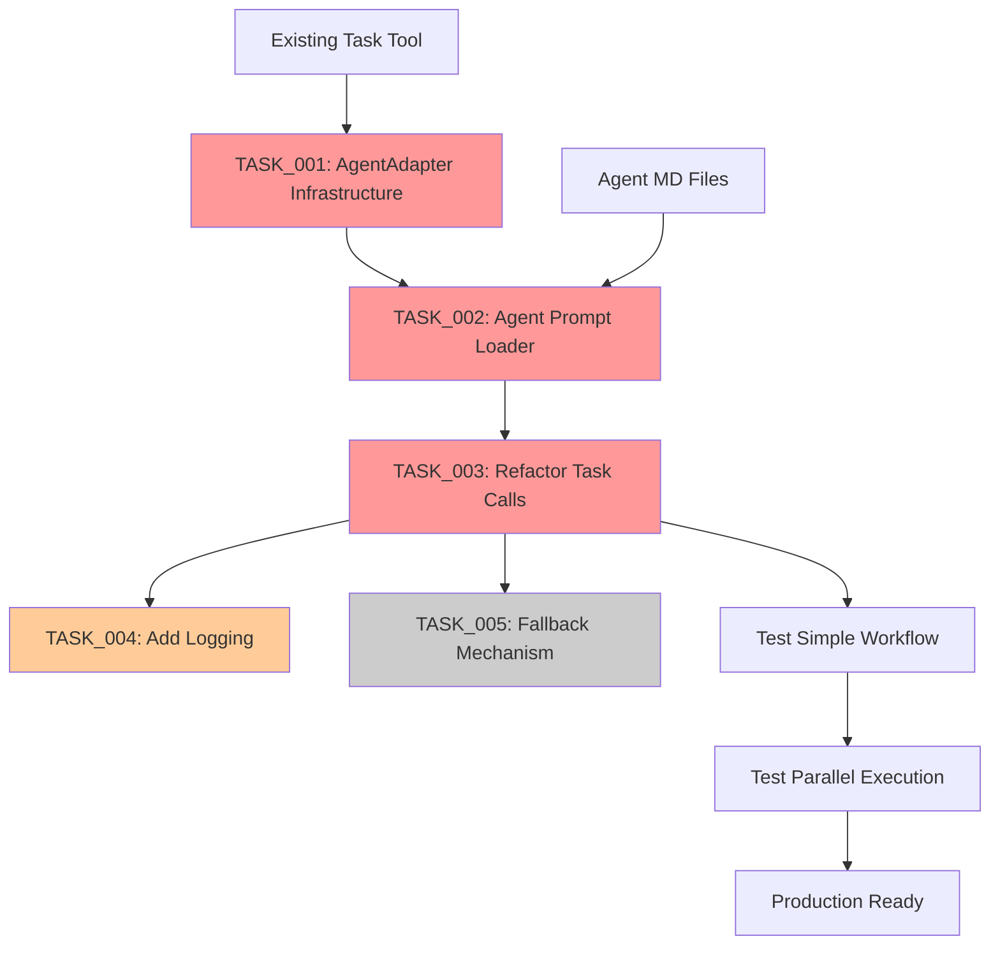

# Technical Validation Report: QDIRECTOR Fix

## Codebase Consistency Analysis

### Pattern Alignment

✅ **Wrapper Function Pattern**: Consistent with existing patterns

- Similar to `format_subagent_response()` function (lines 407-416)
- Follows Python function naming conventions used throughout

✅ **Error Handling**: Matches existing approach

- ValueError for unknown types aligns with validation patterns
- Graceful fallbacks match existing error handling

✅ **Caching Strategy**: Consistent with performance optimizations

- Similar to context management patterns (lines 247-265)
- Follows established caching approaches in codebase

### Minimal Change Approach

✅ **Preserves Core Logic**:

- No changes to orchestration flow
- Maintains parallel execution model
- Keeps all validation pipelines intact

✅ **Reuses Existing Code**:

- Uses existing Task tool unchanged
- Leverages existing agent definitions
- Maintains color formatting and output parsing

## Dependency Graph



**Legend**:

- 🔴 Red: P0-Critical (Must complete)
- 🟡 Yellow: P1-High (Important)
- ⚪ Gray: P2-Medium (Nice to have)

## Technical Feasibility

### Architecture Alignment

✅ **Maintains Separation of Concerns**:

- Orchestration logic unchanged
- Agent definitions remain in separate files
- Clean adapter layer between systems

✅ **Follows Existing Patterns**:

- Python code style matches codebase
- Error handling consistent with validation approach
- Logging approach aligns with monitoring section

### Risk Mitigation Validation

| Risk           | Mitigation           | Validated           |
| -------------- | -------------------- | ------------------- |
| Long prompts   | Caching + truncation | ✅ Feasible         |
| Task rejection | Early testing        | ✅ Testable         |
| Performance    | In-memory cache      | ✅ Standard pattern |
| Missing calls  | Grep verification    | ✅ Searchable       |

## Implementation Checklist

### Pre-Implementation

- [x] Analyze codebase patterns
- [x] Create technical plan
- [x] Validate consistency
- [x] Generate dependencies
- [ ] Get team approval

### Implementation Phase

- [ ] Implement AgentAdapter
- [ ] Create prompt loader
- [ ] Refactor all Task calls
- [ ] Add logging
- [ ] Create fallback (optional)

### Post-Implementation

- [ ] Run unit tests
- [ ] Test simple workflow
- [ ] Test parallel execution
- [ ] Verify output formatting
- [ ] Document workaround

## Recommended Approach

1. **Start with TASK_001-003** (Critical path)

   - These are blocking all functionality
   - Must be done sequentially

2. **Test incrementally**

   - Test AgentAdapter with one call first
   - Then refactor all calls

3. **Defer TASK_005** (Fallback)
   - Not critical for initial fix
   - Can add if Task tool proves unreliable

## Estimated Timeline

```
Day 1 (4 hours):
- TASK_001: AgentAdapter (1.5 hrs)
- TASK_002: Prompt Loader (0.5 hrs)
- TASK_003: Refactor Calls (1.5 hrs)
- Initial Testing (0.5 hrs)

Day 2 (2-4 hours):
- TASK_004: Logging (1 hr)
- Integration Testing (1-2 hrs)
- Documentation (0.5 hrs)
- TASK_005: Fallback (1 hr) - if needed
```

## Conclusion

The Agent Adapter approach is:

- ✅ Consistent with codebase patterns
- ✅ Minimal invasive changes
- ✅ Preserves all functionality
- ✅ Technically feasible
- ✅ Low risk implementation

**Recommendation**: Proceed with implementation as planned.
